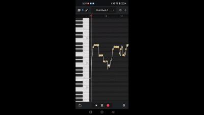

# Humming → MIDI Transcription (Demo)

This repository contains a **demo video** of an AI-based system that converts **humming recordings into editable MIDI sequences**.

The system is designed as a **mobile application prototype** where users can quickly record a melody and obtain a MIDI transcription that can be edited or exported to music production software.

---

## Demo

[Watch the full demo video](demo.mp4)

The demo shows the following workflow:

1. Record a short humming melody  ## Design Motivation

Many melody transcription tools are designed for **instrument recordings or clean studio inputs**, while casual users often need a way to **capture musical ideas quickly through humming**.

This project explores the idea of using AI to build a **mobile-first humming-to-MIDI tool** that enables users to record melodic ideas anywhere and immediately convert them into editable MIDI notes.

The system is particularly aimed at:

- hobbyist composers
- beginner music producers
- musicians capturing spontaneous ideas

By focusing on **mobile recording and noisy environments**, the system prioritizes robustness and convenience over studio-level audio quality.

In addition to transcription, the software provides **basic MIDI editing capabilities**, allowing users to refine generated notes before exporting them to a DAW.

The goal is to provide a **portable idea-capturing tool for melody composition**, lowering the barrier for non-professional musicians to experiment with songwriting.
2. Run AI-based audio analysis  
3. Automatically generate MIDI notes  
4. Edit the MIDI piano roll  
5. Export MIDI file / Music Score

---

## System Overview

The system implements an **end-to-end audio → MIDI pipeline** designed for noisy real-world recordings.

Pipeline:
User humming -> User humming -> Note event detection (ROSVOT) -> Pitch extraction (CREPE) -> Note alignment & MIDI generation -> Editable MIDI piano roll

The goal is to enable **quick melody capture without requiring musical instruments or perfect recording conditions.**

---

## Key Features

- Convert **humming recordings directly to MIDI**
- Designed for **noisy environments**
- Supports **mobile recording**
- Provides **editable MIDI piano roll**
- Allows **MIDI export for DAW software**

---

## Technologies Used

### Audio Processing / Machine Learning

- **Demucs** – vocal separation  
- **ROSVOT** – neural note segmentation  
- **CREPE** – pitch estimation  

### Development Stack

- Python  
- PyTorch  
- Flutter (mobile application prototype)

---

## Current Status

This project is currently a **working prototype**.

Implemented features:

- audio recording  
- AI transcription pipeline  
- MIDI editing  
- MIDI export  

Planned improvements:

- model fine-tuning for off-key humming  
- faster inference via model distillation  
- server-side GPU inference for premium users  
## Design Motivation

Many melody transcription tools are designed for **instrument recordings or clean studio inputs**, while casual users often need a way to **capture musical ideas quickly through humming**.

This project explores the idea of using AI to build a **mobile-first humming-to-MIDI tool** that enables users to record melodic ideas anywhere and immediately convert them into editable MIDI notes.

The system is particularly aimed at:

- hobbyist composers
- beginner music producers
- musicians capturing spontaneous ideas

By focusing on **mobile recording and noisy environments**, the system prioritizes robustness and convenience over studio-level audio quality.

In addition to transcription, the software provides **basic MIDI editing capabilities**, allowing users to refine generated notes before exporting them to a DAW.

The goal is to provide a **portable idea-capturing tool for melody composition**, lowering the barrier for non-professional musicians to experiment with songwriting.
---
## Design Motivation

Many melody transcription tools are designed for **instrument recordings or clean studio inputs**, while casual users often need a way to **capture musical ideas quickly through humming**.

This project explores the idea of using AI to build a **mobile-first humming-to-MIDI tool** that enables users to record melodic ideas anywhere and immediately convert them into editable MIDI notes.

The system is particularly aimed at:

- hobbyist composers
- beginner music producers
- musicians capturing spontaneous ideas

By focusing on **mobile recording and noisy environments**, the system prioritizes robustness and convenience over studio-level audio quality.

In addition to transcription, the software provides **basic MIDI editing capabilities**, allowing users to refine generated notes before exporting them to a DAW.

The goal is to provide a **portable idea-capturing tool for melody composition**, lowering the barrier for non-professional musicians to experiment with songwriting.

## Demo Purpose

This repository is intended to demonstrate the **system workflow and capabilities**.

The full source code is not publicly released because the project is planned to be developed as a **commercial mobile application**.
